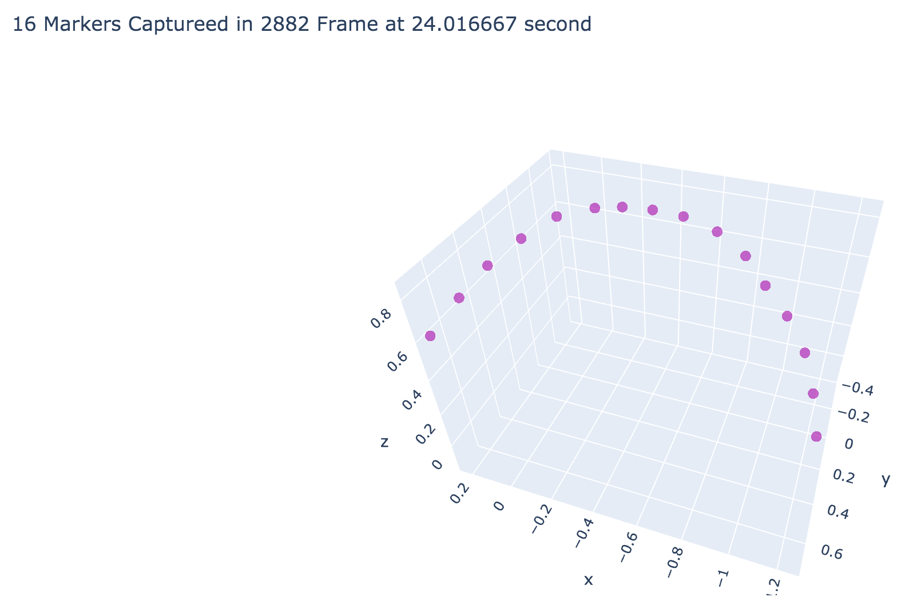
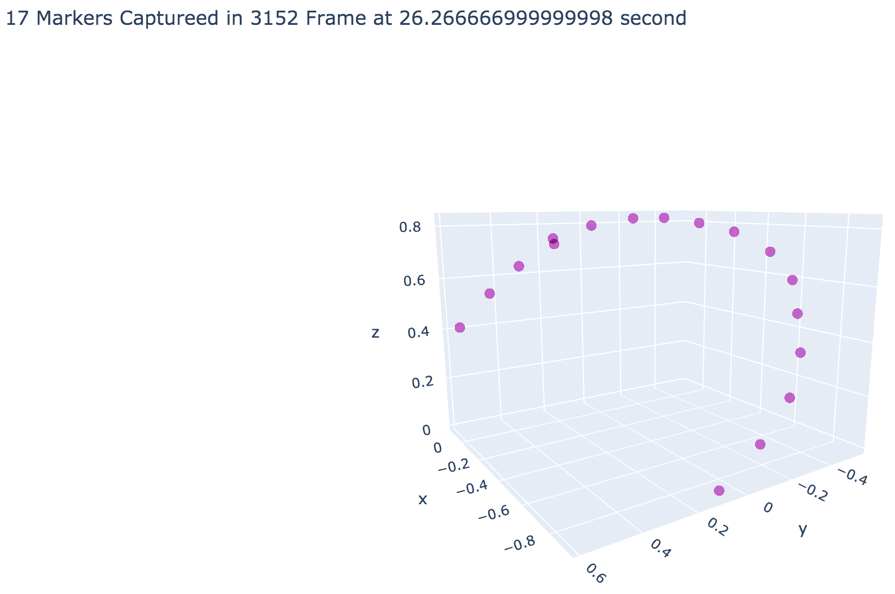

# Soft Object Representation
On Data-Driven Representation of Bimanual Soft Object Manipulation Tasks

[Detail Analysis Result](./RepresentationAnalysis.html)

- Data Preliminary Exploration

  

- Data Visualization Result

  

- Representation with PCA (Benchmark)

  

- Auto-Encoder (Linear Activation Function)

- Auto-Encoder (Non-linear Activation Fuction)

- ISOMAP

- Random Forest

