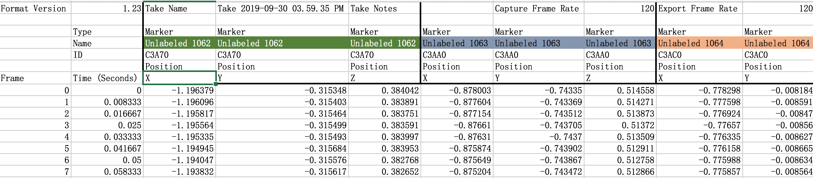

# Soft Object Representation
On Data-Driven Representation of Bimanual Soft Object Manipulation Tasks

- Data Preliminary Exploration

  

- Data Visualization Result

  <iframe src="./VisualizationRes/15Markers.html" width="700px" height="500px" frameborder="0" scrolling="no"> </iframe>

  
- Representation with PCA (Benchmark)

